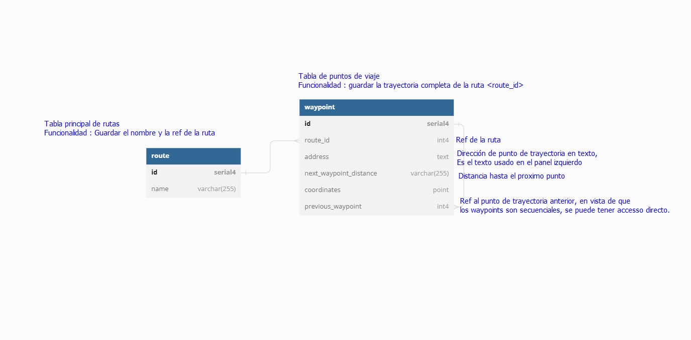

### Aplicacion de prueba YII2 google maps
---
***Que necesitas para correr la aplicacion?***
1) Ejecutar o comando
> `git clone https://github.com/jmar1998/yii2-google-maps.git`
2) Definir las credenciales para google maps en el archivo config/params.php
3) Es necesario tener docker instalado
Para instrucciones de instalación se puede consultar el link siguiente : [Docker installation](https://docs.docker.com/engine/install)

***Como iniciar la aplicacion?***
> Luego de tener nuestro docker instalado y ejecutandose, puedes iniciar la aplicacion ejecutando en la CLI el siguiente comando:

> `docker compose up -d`

***Como acceder a la aplicacion
> Puedes acceder directamente con en link : [Abrir la app](http://localhost)

***Adicional***
> Para visualizar el esquema de la base de datos y algunas informaciones sobre el diseño, puede ver el archivo database.png

***Como es el proceso de inicialización de la aplicación ?***
> Basicamente son ejecutados los siguientes procesos
1. Composer install : Para instalar dependencias
2. Se corrigen permisos de directorios criticos para Yii2
3. Son ejecutadas migrations : Para crear la base de datos necesaria

***Archivos clave en la aplicación***
1. ./web/libraries/google-maps/google-maps.js
> En esta libreria son preparados todos los datos, asi como tambien la renderización y normalización de los datos a partir de la API de google maps
2. ./forms/RouteForm.php
> En este archivo son transformados los datos que proceden a partir de la libreria ./web/libraries/google-maps/google-maps.js, para algo manejable en los modelos/base de datos, a su vez son ejecutados procesos para simplificar el proceso de creación y actualización de las rutas

***Cambios Relevantes V2***
1. Hubo una reformulación en el codigo para añadir la posibilidad de agregar mas de 26 paradas
- La API Google maps no permite crear rutas con mas de 24 paradas (24 + 2 [origen y destino])
- Para sobrepasar este problema se crean "chunks" de 26 paradas y hacemos 1 pedido por cada chunk, posteriormente se junta en el mapa siendo que el ultimo punto de cada "chunk" es el origen de cada bloque posterior
2. Simplificacion de la manera de renderizar los marcadores
3. Corregido el delete de los marcadores
4. Para disminuir la cantidad de pedidos se guarda en la base de datos el pedido original
- La información es posteriormente comprimida para disminuir el uso de memoria durante el guardado y espacio en la db
- En nuestro caso es un array de pedidos para permitir varias rutas de +26 paradas

***Como actualizar la base de datos***
> Ejecutando este comando puedes actualizar la estructura de la base de datos
> `echo "y" | sudo docker compose exec php ./yii migrate/up`
- Tambien puedes ejecutar `docker compose down && docker compose up`;