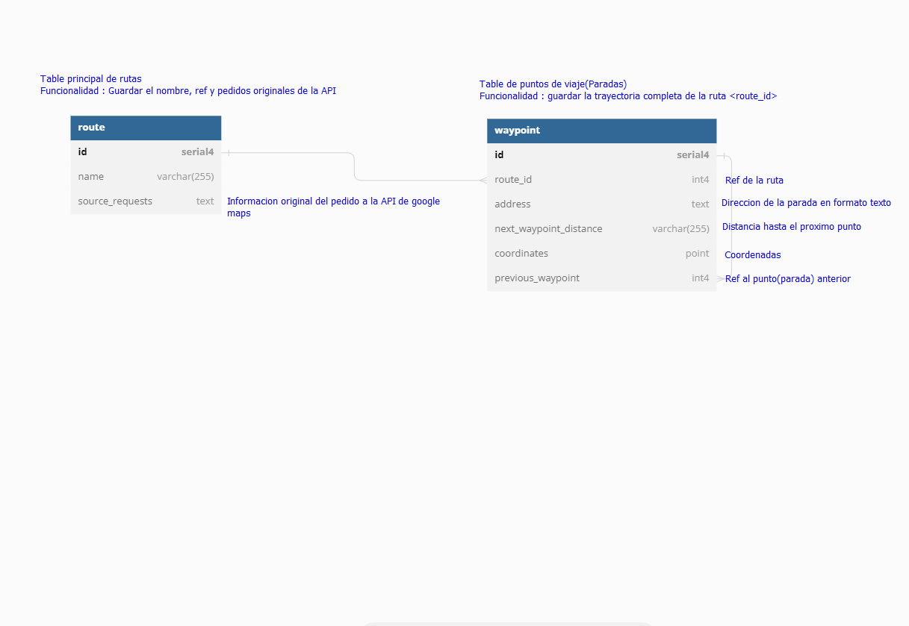

### Aplicacion de prueba YII2 google maps
---
***Que necesitas para correr la aplicacion?***

Solo es necesario tener docker instalado.

Para instrucciones de instalación se puede consultar el link siguiente : [Docker installation](https://docs.docker.com/engine/install)

***Como iniciar la aplicacion?***
> Luego de tener nuestro docker instalado y ejecutandose, puedes iniciar la aplicacion ejecutando en la CLI el siguiente comando:

> `docker compose up -d`

***Como acceder a la aplicacion
> Puedes acceder directamente con en link : [Abrir la app](http://localhost)

***Adicional***
> Para visualizar el esquema de la base de datos y algunas informaciones sobre el diseño, puede ver el archivo database.png

***Como es el proceso de inicialización de la aplicación ?***
> Basicamente son ejecutados los siguientes procesos
1. Composer install : Para instalar dependencias
2. Se corrigen permisos de directorios criticos para Yii2
3. Son ejecutadas migrations : Para crear la base de datos necesaria

***Archivos clave en la aplicación***
1. ./web/libraries/google-maps/google-maps.js
> En esta libreria son preparados todos los datos, asi como tambien la renderización y normalización de los datos a partir de la API de google maps
2. ./forms/RouteForm.php
> En este archivo son transformados los datos que proceden a partir de la libreria ./web/libraries/google-maps/google-maps.js, para algo manejable en los modelos/base de datos, a su vez son ejecutados procesos para simplificar el proceso de creación y actualización de las rutas